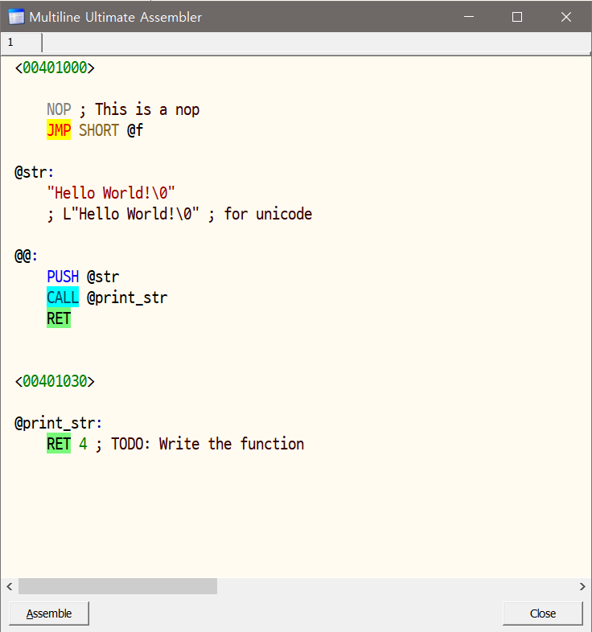

# Multiline Ultimate Assembler (Mod version)

This is a modified version of the original **[Multiline Ultimate Assembler](https://github.com/m417z/Multiline-Ultimate-Assembler)** (by RaMMicHaeL / m417z) plugin for **x64dbg** and **OllyDbg**. 

It resolves several long-standing usability issues, including Korean IME (Input Method Editor) input bugs and syntax highlighting improvements.



---

## 🚀 Key Improvements & Fixes

### 1. Complete Korean IME Support (IME Fix)
* **Before:** Writing Korean letters in the Scintilla assembler editor caused character corruption, combination overlaps, or skipped keystrokes.
* **After:** Fixed internal Windows IME message processing so that **Korean letters combine and display smoothly** without any input delays or skips.

### 2. Modern Code Fonts & Enhanced Syntax Highlighting
* **Before:** Courier-based tiny default fonts caused straining in high-DPI environments, with a basic single-color syntax styling.
* **After:** Updated default layouts with clean, **resizable fixed-width monospace fonts** and customized assembly syntax coloring:
  * **`JMP` family**: Distinctive custom style (`SCE_ASM_JMP`) for branch controls.
  * **`CALL` family**: Colored highlight (`SCE_ASM_CALL`) for subroutines.
  * **`RET` family**: Marked boundaries (`SCE_ASM_RET`) for return execution.
  * **`NOP` family**: Dimmed gray color (`SCE_ASM_NOP`) for clear patch identification.
  * Optimized rendering routines to completely eliminate editor flickering during dynamic custom styling repaints.

---

## 📦 Repository Structure

```
multi/v8/
├── x86/
│   └── Scintilla.dll      <- 32-bit Scintilla DLL (for OllyDbg / x32dbg)
├── x64/
│   └── Scintilla.dll      <- 64-bit Scintilla DLL (for x64dbg x64)
├── minicrt/               <- Minimal CRT Library
├── ollydbglib/            <- OllyDbg import libraries
├── x64dbg_pluginsdk/      <- x64dbg Plugin SDK
├── rsrc_files/            <- Resource icons & assets
├── MUltimate Assembler.sln
└── MUltimate Assembler.vcxproj
```

---

## 🛠️ How to Build

Open developer command prompt or MSBuild tool to compile the binaries.

#### 1. OllyDbg Plugin (Win32)
```bash
msbuild "MUltimate Assembler.vcxproj" /p:Configuration=Release_odbg /p:Platform=Win32 /t:Build
```
Output: `Release/multiasm_odbg.dll`

#### 2. x64dbg Plugin (32-bit / 64-bit)
```bash
# 32-bit (x32dbg)
msbuild "MUltimate Assembler.vcxproj" /p:Configuration=Release_x64dbg /p:Platform=Win32 /t:Build

# 64-bit (x64dbg)
msbuild "MUltimate Assembler.vcxproj" /p:Configuration=Release_x64dbg /p:Platform=x64 /t:Build
```
Output: `Release/multiasm_x64dbg.dp32` & `Release/multiasm_x64dbg.dp64`

---

## 🔧 Installation & Deployment

When deploying the plug-in binaries into your debugger's plugins directory, you **must copy the correct architecture version of `Scintilla.dll`** to the same folder:

1. **For OllyDbg / x32dbg**: Copy the compiled plugin alongside **`x86/Scintilla.dll`** to your plugins directory.
2. **For x64dbg (64-bit)**: Copy the compiled plugin alongside **`x64/Scintilla.dll`** to your plugins directory.
